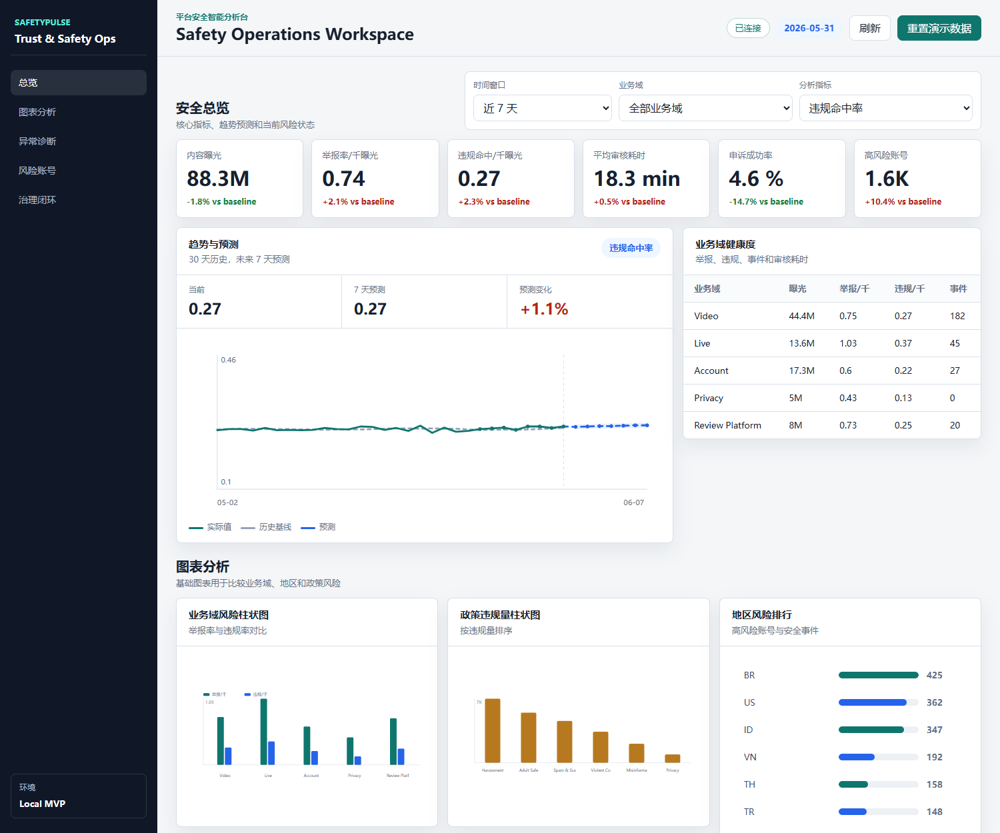

# SafetyPulse: Platform Safety Intelligence Hub

一个本地可运行的平台安全智能分析台，面向内容安全、直播安全、账户安全、隐私合规和审核平台场景。系统会生成模拟安全指标，自动检测异常，拆解根因贡献，并把分析结果沉淀到治理动作中心。



## 项目亮点

- **核心指标体系**：曝光、举报率、违规命中率、审核耗时、申诉成功率、高风险账号。
- **异常检测**：基于历史窗口建立 baseline，用波动分数和最小样本门槛生成 P0/P1/P2 告警。
- **根因分析**：按业务域、地区、政策类型拆解贡献度，定位异常主要来源。
- **趋势预测**：展示历史走势、历史基线和未来 7 天轻量预测区间。
- **基础图表层**：提供业务域对比柱状图、政策违规量柱状图和地区风险排行。
- **账号 Drill-down**：从宏观异常下钻到高风险账号样本、账号簇、举报/违规量和处置建议。
- **行动闭环**：为异常生成治理动作，记录 owner、状态和预期影响。
- **产品化形态**：左侧导航 + 多工作区布局，不是一次性 notebook 或单页报表。

## 启动

```powershell
$PY="C:\Users\pc\.cache\codex-runtimes\codex-primary-runtime\dependencies\python\python.exe"
& $PY server.py
```

打开：

```text
http://127.0.0.1:8000
```

## Safety APIs

- `POST /api/safety/seed?reset=true`：生成演示安全指标和治理动作
- `GET /api/safety/summary?days=7&surface=all`：核心指标、业务域健康度和政策风险分布
- `GET /api/safety/anomalies?lookback_days=14`：异常检测结果
- `GET /api/safety/root-cause?metric=violation_rate&days=7&surface=all`：根因贡献度和审核漏斗
- `GET /api/safety/trends?metric=violation_rate&days=30&surface=all`：历史趋势和未来 7 天预测
- `GET /api/safety/accounts?limit=30&surface=all`：高风险账号样本
- `GET /api/safety/actions`：治理动作中心

## 技术设计

- 后端：Python 标准库 HTTP server + SQLite
- 前端：原生 HTML/CSS/JavaScript
- 数据：可复现的合成安全指标，覆盖 42 天、5 个业务域、6 个地区、6 类政策，并生成高风险账号样本
- 测试：`unittest` 覆盖归因逻辑和 SafetyPulse 分析逻辑

## 保留的埋点归因 API

原有的事件接入和简单归因能力仍保留：

- `POST /api/events`
- `GET /api/attribution`
- `POST /api/demo?reset=true`

## 测试

```powershell
$PY="C:\Users\pc\.cache\codex-runtimes\codex-primary-runtime\dependencies\python\python.exe"
& $PY -m unittest discover tests
```
